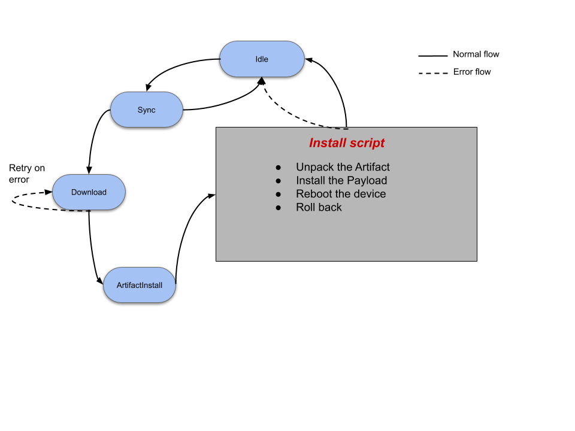
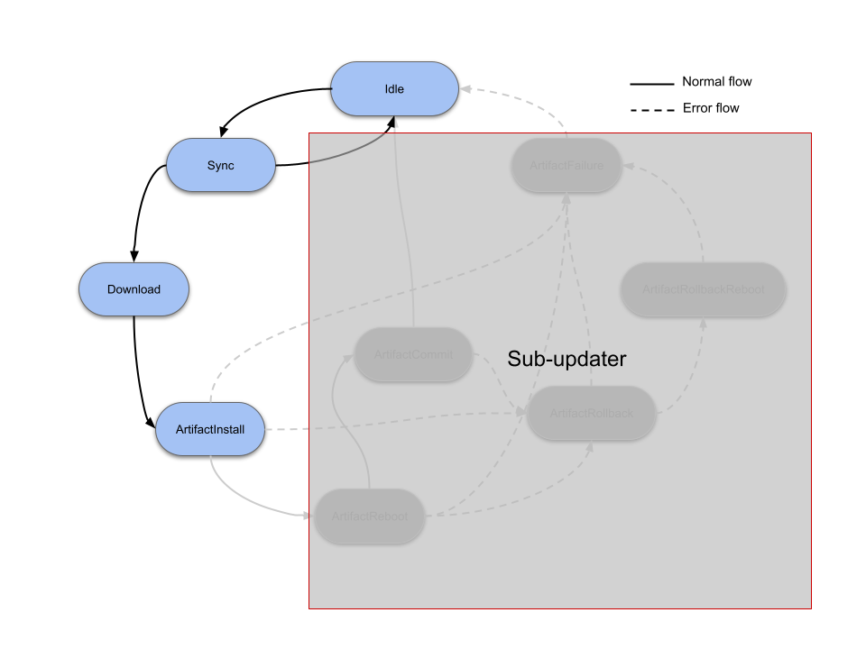

[](https://gitlab.com/Northern.tech/Mender/mender-python-client/pipelines)
[](https://coveralls.io/github/mendersoftware/mender-python-client?branch=master)
[](https://lgtm.com/projects/g/mendersoftware/mender-python-client/alerts/)
[](https://lgtm.com/projects/g/mendersoftware/mender-python-client/context:python)

Mender Python Client: A Python implementation of the Mender client
==============================================


## Overview

The _Mender Python Client_ is an API client, which is responsible for
interacting with the Mender server, and downloading the Artifact for a
deployment to a specified location on the device, and then exit until a local
sub-updater on the device has handled the update, reported the update status
(failed, or success), and re-started the _Mender Python Client_ thereafter.

## Workings

The _client_ in daemon mode does periodic checks for updates at a configurable
interval, and downloads the Artifact for the deployment to a given location on
the device. Then control is passed over to the _sub-updater_ through calling the
script `/usr/share/mender/install <path-to-downloaded-artifact>`.

This forks off a child-process, which then executes the install script. The
_client_ itself, will then exit, since all its obligations are now fulfilled.
If your script has been started, by say _systemd_, make sure that the
sub-process is not killed upon exit. This can be done by adding:

```
...
[service]
...
KillMode=process
```

to your unit file specification. For other init systems, keep this in mind.

Following upon this, it is now the responsibility of the _sub-updater_ to unpack
the Artifact, install it to the passive partition, reboot the device, and commit
the update (or roll back in case of errors, if so is required). Then report the
update status through calling `mender-python-client report
<--success|--failure>`, and then remove the lock-file, to have the _Mender
Python Client_ start looking for updates again.

After a successful update, the _sub-updater_ is responsible for updating the
_artifact_info_ file located in `/etc/mender/artifact_info`, to reflect the name
of the Artifact just installed on the device. This is important, as this is the
version reported to the _Mender Server_ when polling the server for further
updates. The `artifact_info` file has to have the structure:

```
artifact_name=<name-of-current-installed-artifact>
```

The `device_type` is taken from `<datadir>/device_type` file, and has to have the structure:

```
device_type=<some-device-type>
```

## Known limitations

The _Mender Python Client_ is not a fully fledged _Mender Client_ updater, like
the original [_Mender Client_](https://github.com/mendersoftware/mender). As
such, there are certain limitations to keep in mind, when incorporating it into
your device setup.

For one, the _Mender Python Client_ holds no responsibility over either the
reliability of the downloaded _Mender Artifact_, nor does it concern itself with
anything which happens after the Artifact is downloaded, and the _install
script_ has been spawned. All of this has to be managed by the sub-updater. This
includes starting the daemon back up after it has exited.

Secondly, the _Mender Python Client_ currently only reports the following deployment
status back to the Mender server:

* Downloading
* Success
* Failure

### State-machine

The _Mender Python Client_ can run as a daemon, with the _daemon_ command,
however, only a subset of the states are supported, due to the handoff to the
'install' script. The states supported are:

* **Idle**: The Mender client idles and waits for the next action to handle. At this stage, no communication with the server, or downloads are in progress.
* **Sync**: At this stage the Mender client will either send or update its inventory to the server, or check if an update is available. This requires communication with the server.
* **Download**: When an update is ready at the server side Mender downloads it (streams it) to a designated file in `<datadir>/`.
* **ArtifactInstall**: Calls the `sub-updater` to hand over the rest of the installation.

The remaining functionality has to be supported by the `sub-updater`.

In short, these are the responsibilities which the `sub-updater` has to handle:


And this is roughly equivalent to covering the following states in the original
_mender-client_ state-machine:



### Configuration

The _Mender Python Client_ has the same configuration setup as the original
client, with a global and a local [configuration
file](https://docs.mender.io/client-installation/configuration-file). However,
with fewer configuration options, due to the minimal nature of the
implementation.

The _Mender Python Client_ respects this subset of configuration variables
supported by the original _Mender Client_:

* [RootfsPartA](https://docs.mender.io/client-installation/configuration-file/configuration-options#rootfsparta)
* [RootfsPartB](https://docs.mender.io/client-installation/configuration-file/configuration-options#rootfspartb)
* [ServerURL](https://docs.mender.io/client-installation/configuration-file/configuration-options#serverurl)
* [ServerCertificate](https://docs.mender.io/client-installation/configuration-file/configuration-options#servercertificate)
* [TenantToken](https://docs.mender.io/client-installation/configuration-file/configuration-options#tenanttoken)
* [InventoryPollIntervalSeconds](https://docs.mender.io/client-installation/configuration-file/configuration-options#inventorypollintervalseconds)
* [UpdatePollIntervalSeconds](https://docs.mender.io/client-installation/configuration-file/configuration-options#updatepollintervalseconds)
* [RetryPollIntervalSeconds](https://docs.mender.io/client-installation/configuration-file/configuration-options#retrypollintervalseconds)


## Contributing

We welcome and ask for your contribution. If you would like to contribute to the
Mender project, please read our guide on how to best get started [contributing
code or
documentation](https://github.com/mendersoftware/mender/blob/master/CONTRIBUTING.md).

## License

Mender is licensed under the Apache License, Version 2.0. See
[LICENSE](https://github.com/mendersoftware/mender-python-client/blob/master/LICENSE) for
the full license text.

## Security disclosure

We take security very seriously. If you come across any issue regarding
security, please disclose the information by sending an email to
[security@mender.io](security@mender.io). Please do not create a new public
issue. We thank you in advance for your cooperation.

## Connect with us

* Join the [Mender Hub discussion forum](https://hub.mender.io)
* Follow us on [Twitter](https://twitter.com/mender_io). Please
  feel free to tweet us questions.
* Fork us on [GitHub](https://github.com/mendersoftware)
* Create an issue in the [bugtracker](https://tracker.mender.io/projects/MEN)
* Email us at [contact@mender.io](mailto:contact@mender.io)
* Connect to the [#mender IRC channel on Freenode](http://webchat.freenode.net/?channels=mender)


## Authors

[List](https://github.com/mendersoftware/mender-python-client/graphs/contributors)!

The [Mender](https://mender.io) project is sponsored by [Northern.tech
AS](https://northern.tech).
